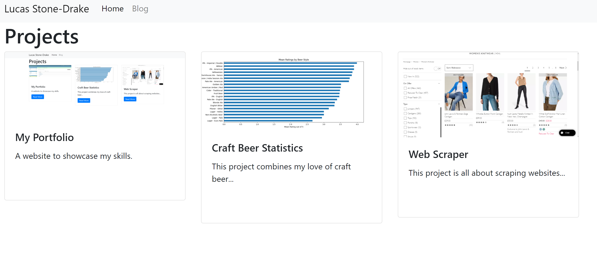

# Introduction

This is the repository for a website which showcases my projects and my blog. The website is deployed via Pythonanywhere and is available to view at https://lucasstonedrake.eu.pythonanywhere.com/  

## Technologies

Python 3.9, django, Pythonanywhere, coverage, black

## Known Issues

- blogs can only contain text
- blog category view can display duplicate blog posts

## Project Status

Still being developed. 

###### To do:
- maintain and improve the test suite
- add image capability to blog posts
- write more blogs!
- implement continuous integration
- incorporate my craft beer statistics project into this project
- change timezones to GMT/BST
- investigate blog category bug referenced above

